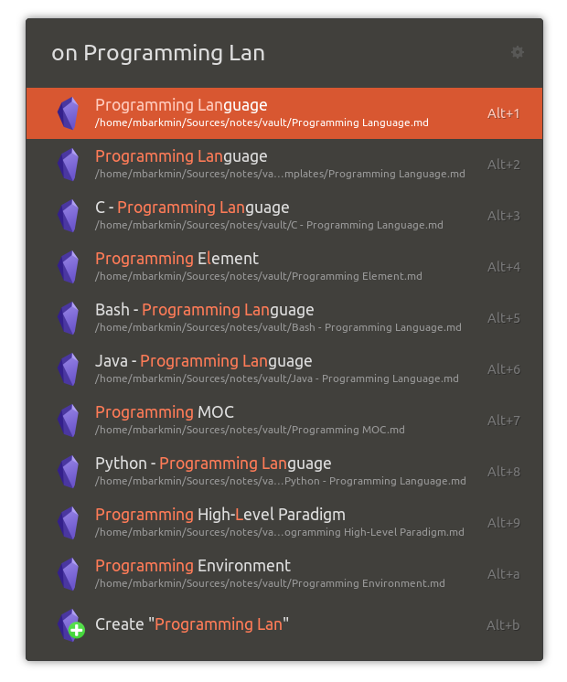

# Obsidian Ulauncher extension



This Ulauncher extension enables you to search your [obsidian.md](https://obsidian.md/) vault and create new notes on the fly.

## Features

Keywords are customizable

* on: Open note based on filename
* of: Search the content of all notes
* [Planned] od: Open daily note
* [Planned] oc: Quick capture to a note

## Install

Then open Ulauncher preferences window > extensions > add extension and paste the following url:

```
https://github.com/mikebarkmin/ulauncher-obsidian
```

## Developer

### 

### Run Test

Currently doctest is used for the `functions` module. To run the tests execute the following command:

```
python3 src/functions.py
``` 